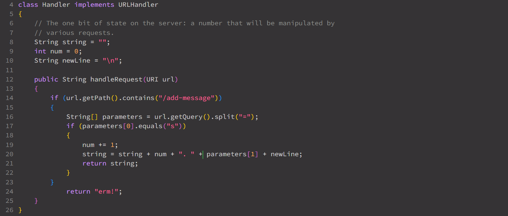
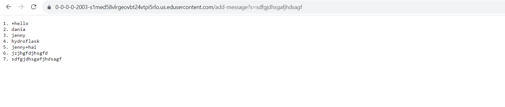
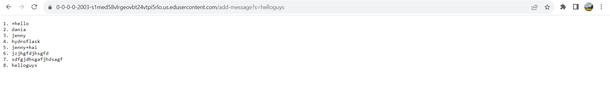

# Lab Report 2 - Servers & SSH Keys 
## Part 1
#### StringServer Code: 

#### Two Examples Using StringServer

* In both of these exmaples, the handleRequest method is called and the URL of the server is passed in.
* From there, the method ".getPath()" and ".contains()" get called to check the condition.
* Since the paths meet the condition (being "/add-message"), the url method ".getQuery()" gets called which retrives the query which in our exmaples are "helloguys" and the string of letters.
* After, the ".split()' method gets called which divides our query into a list between the '=' symbol. 

## Part Three
* In the past weeks, I have learned the format of a url and the importance of the order of the domain, path, query, etc. I was surprised to see how standarized/universal it was across all platforms. Most importantly, I learned how to manipulate information passed in through a URL and how to display different outputs thorugh the use of servers and Java. I did not know I could do things like that through Java and I was pleasantly surprised to see that learning curve was not as bad as I thought it would be. The documentation helped a lot.  
