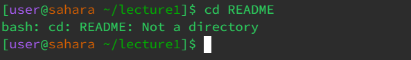
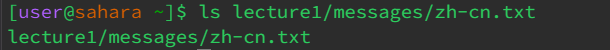
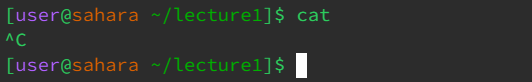
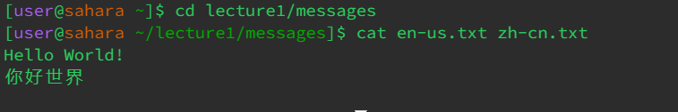

# Lab Report 1 - Remote Access and File System 
## cd command
The 'cd' command, short for "Change Directory", is a command used to switch between directories and change the current working directory.
#### No Arugments  
* When working in any other directory besides the '/home' directory, using this command with argument results in a return to your home (/home) directory, as seen below:

* Here, we change our working directory to the 'lecture1' directory and when cd without an argument is used, the user is returned to the '/home' directory.
* Working in the '/home' directory, using the 'cd' command with no arguments does not produce an output or change in the current working directory, as shown below:

* The resulting line, rather the lack thereof, is due to a lack of specification of the directory the user wants to use as their new working directory. Since no argument/directory name is provided, the working directory ('/home') remains the same.
* This is not necessarily an error as seen in our first exmaple. Since we are already working in the '/home' directory, it does not change our working directory. 
#### Using a Path to a Directory 
* Using the command with a path to a directory causes a change in the user's working directory. In our example, we begin in the '/home' directory, use the command 'cd' followed by a relative path to the directory 'lecture1'. The working directory is then changed to 'lecture1', and is shown as follows:

* *It is important to note that this does not cause error because 'lecture1' is directly within the home directory.*  
#### Using a Path to a File 
* Now working in the directory 'lecture1' and using the command with a realtive path to a file, the terminal prints an error given that the command is only used for directories. The message looks as follows: 

## ls command
The 'ls' command, short for "List", is a command used to print out the list of files and directories within a given path.
#### No Arugments 
* Working in the '/home' directory, using the 'ls' command with no arguments returns the list of files amd directories, as shown below:

* This can be intepretted as the '/home' directory only containing one directory named 'lecture1'.
#### Using a Path to a Directory 
* Working in the '/home', using the 'ls' command with a relative path to a directory will also print out a list of files and other directories in the directory referenced. For example, if we provide a relative path to lecture1, it will print out the following:
  
* *Again, it is important to note that this does not cause error because 'lecture1' is directly within the '/home' directory.*  
#### Using a Path to a File 
* Working in the '/home' directory and using a relative path to a file will return the relative path provided as an argument as shown below:

* This behavior occurs regardless of the directory you are in. In the following example, we switch to the 'lecture1' directory and retry the 'ls' command with 'lecture1' as our working directory and a relative path to the 'README' file:

## cat command
The 'cat' command, short for "Concatenate", which is used to print out the contents of one or more files. 
#### No Arugments 
* Working in the '/home/' directory and using the command with no arguments results in error and looks as follows: 

* Although not stated explicitly, there is an error at runtime as the command does not output anything nor does it display an error message.
#### Using a Path to a Directory 
* Using the command with a path to a directory results in a message stating that the relative provided references a directory. In our example, we begin in the '/home' directory, use the command followed by a relative path to the directory 'lecture1'. Terminal prints the following:

* This command returns an error message as the user did not use a legal input for the command. A directory was provided as opposed to a path to a file. 
#### Using a Path to a File
* Working in the '/home' directory and using a relative path to a the 'README' file in the 'lecture1' directory will return the contents of the referenced file, for example:

* This command also works for multiple files as well. For example, when switching/working in the 'messages' directory and using a relative paths to the 'en-us.txt' and 'zh-cn.txt' files, it will printout the contents of both files:

* *The content for both files are combined into one input as seen above.*

