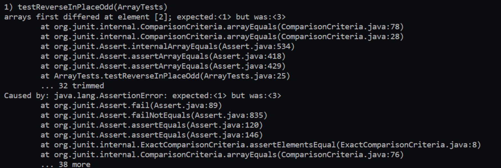
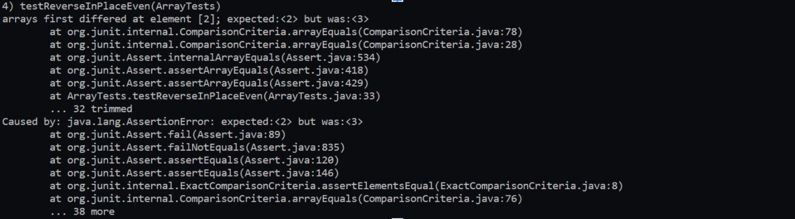

# Lab 3: Bugs and Commands 
## Part One: Bugs 
### Failure inducing input for ```reverseInPlace()```

This first tests tests the accuracy of the input of an array with an odd size! 
```
@Test
public void testReverseInPlaceOdd()
{
  int[] input1 = {1,2,3};
  ArrayExamples.reverseInPlace(input1);
  assertArrayEquals(new int[]{3,2,1}, input1};
}
```

This second tests tests the accuracy of the input of an array with an even size! 

```
  @Test 
	public void testReverseInPlaceEven() 
  {
    int[] input1 = {1,2,3,4};
    ArrayExamples.reverseInPlace(input1);
    assertArrayEquals(new int[]{4,3,2,1}, input1);
	}
```


### Non-failure inducing input for ```reverseInPlace()```
```
@Test
public void testReverseInPlaceOdd()
{
  int[] input1 = {};
  ArrayExamples.reverseInPlace(input1);
  assertArrayEquals(new int[]{}, input1};
}
```
### Symptoms: 
This is the output for testing the odd-sized array - in this case, we used the array {1,2,3}: 


This is the output for testing the even-sized array - in this case, we used the array {1,2,3,4}: 


### Code with bug: 
```
static void reverseInPlace(int[] arr)
  {
      for(int i = 0; i < arr.length; i += 1)
     {
        arr[i] = arr[arr.length - i - 1];
    }
  }
```

### Fixed: 
```
static void reversedInPlace(int[] arr)
{
  for (int i = 0; i < arr.length / 2; i++)
  {
    int temp = arr[i];
    arr[i] = arr[arr.length - i - 1];
    arr[arr.length - i - 1] = temp; 
  }

}
```
##### Explanation: In the previous code, the coder failed to account for the value they replaced when assigning the current index to the value of the end of the list. Once replaced, there was no way to get the value that once was at index 'i'. To remedy this, I added a temporary variable to store the value of the current index 'i'. Furthermore, when reversing an array, it can be interpretted as the indices on "opposite" ends switching values, so I also added that step where the index that has its value placed into 'i' also receives the value of 'i' through the temporary value. Lastly, to prevent overwriting values that were already replaced, I split the list in half! 
## Part Two: Researching Commands
## ```grep```

- ```-i``` (ignore case): This command option ignores the case of the the patter it is searching! For example, working in the technical directory, using ```grep -i 'color' biomed/*.txt``` yields: 

```
$ grep -i 'color' biomed/*.txt
biomed/1471-2105-2-9.txt:          Figure 3. The groups from FastGroup are color coded on
biomed/1471-2105-3-17.txt:            What is noticeable through the color scheme (Table
biomed/1471-2105-3-17.txt:            majority of genes are colored in green, indicating
biomed/1471-2105-3-2.txt:            color-coded confidence ratings with each proposed base
biomed/1471-2105-3-2.txt:            chi-square-based algorithm [ 71 ] , and thus the color
biomed/1471-2105-3-2.txt:            circle, using the same coloring scheme as in the
biomed/1471-2105-3-2.txt:            unique color code in the illustrations on the "RNA
biomed/1471-2105-3-2.txt:            pair). The colors green, black, and grey denote base
biomed/1471-2105-3-2.txt:            there are two numbers. The orange color refers to the
biomed/1471-2105-3-2.txt:            the pink color refers to the number of mutual changes
biomed/1471-2105-3-2.txt:            Location;" H-3F.3). In this table, color is used to
biomed/1471-2105-3-2.txt:            Results/Page, and Color Display are also displayed on
biomed/1471-2105-3-2.txt:            • Color Display: to help distinguish the organism
biomed/1471-2105-3-2.txt:            color when the organism names are the same. The colors
biomed/1471-2105-3-2.txt:            the lower, purple-colored panel of the Selection Frame
biomed/1471-2105-3-2.txt:            ...]. The RNA types are indicated in different colors
biomed/1471-2105-3-37.txt:          Streptomyces coelicolor , 
biomed/1471-2105-4-25.txt:          (TSS). A set of small color squares represent the
biomed/1471-2105-4-25.txt:          the mouse on these colored squares, a contextual menu
biomed/1471-2105-4-26.txt:        same principles should be readily applicable to two color
biomed/1471-2121-1-2.txt:          (Colorado Serum Company), 0.22% sodium bicarbonate, 4 mM
biomed/1471-2121-2-1.txt:          color reaction or enhanced chemiluminescence,
biomed/1471-2121-2-21.txt:          Aves Labs, Tigard, OR). Color development was achieved by
biomed/1471-2121-3-16.txt:          ADE3 color marker. Cells that have
biomed/1471-2121-3-16.txt:          of the red color. To assay sectoring, colonies were
biomed/1471-2121-3-25.txt:        coat color mutation 
biomed/1471-2121-3-25.txt:          MD). In some cases, gray scale images were pseudo-colored
biomed/1471-2121-4-3.txt:          captured using a RT220 color digital camera (Diagnostic
biomed/1471-213X-1-11.txt:          Dual color immunohistochemistry experiments
biomed/1471-213X-1-11.txt:          interact themselves. Hence, we employed dual color
biomed/1471-213X-1-11.txt:          Grenoble, France). The captured color images were
biomed/1471-213X-1-11.txt:          Dual-Color (Peroxidase/Fluorescence)
biomed/1471-213X-1-11.txt:          Dual-color immunohistochemistry [ 35] experiments were
biomed/1471-213X-1-11.txt:          Microphotography was performed using color negative
biomed/1471-213X-1-13.txt:          not hydrolyzed. Following color development, the embryos
biomed/1471-213X-1-15.txt:          signal. We generated pseudocolored images indicating up
biomed/1471-213X-1-4.txt:        fluorescent protein (EYFP or ECFP), two color variants of
biomed/1471-213X-1-4.txt:        http://www.clontech.com/gfp/pdf/LivingColors.pdf.
biomed/1471-213X-1-6.txt:        silvery body coloration, while males had a golden cast to
biomed/1471-213X-3-4.txt:          and colorimetric reaction kit (Histostain Plus, Zymed).
biomed/1471-2148-1-14.txt:        Kir resiude positions of Fig. 5b, that were colored
biomed/1471-2148-2-12.txt:          distinguished by their colony color. Relative fitness was
biomed/1471-2148-2-14.txt:        analysis of our strains: 1) color change is easy to monitor
biomed/1471-2148-2-14.txt:        and quantitate; 2) color change is very sensitive and
biomed/1471-2148-2-14.txt:          violet was used as a redox dye to colorimetrically
biomed/1471-2148-2-14.txt:          tetrazolium dye forming a purple color. Other wells
biomed/1471-2148-2-14.txt:          remained colorless (as an indicator of loss of function
biomed/1471-2148-2-14.txt:          colorless negative control. The sequenced reference
biomed/1471-2148-2-14.txt:          tetrazolium color changes have been described by Bochner
biomed/1471-2148-2-2.txt:        Sorghum bicolor (L.) Moench) is a
biomed/1471-2156-2-1.txt:        coat color. D2 mice have a mutant allele of this gene ( 
biomed/1471-2156-2-1.txt:        Tyrp1 b) and a brown coat color [
biomed/1471-2156-2-1.txt:        evident by their brown coat color and the inheritance of D2
biomed/1471-2164-2-1.txt:          N-cadherin, P-cadherin, N-CAM, deleted in colorectal
biomed/1471-2164-2-4.txt:          differently colored fluorophore: fluorescein (FAM) and
biomed/1471-2164-3-1.txt:          lacZ resulting in blue color when
biomed/1471-2164-3-15.txt:          of coloration. Unlike asexual animals, mature planaria of
biomed/1471-2164-3-19.txt:        fluorescent signal ratios in two-color competitive
biomed/1471-2164-3-29.txt:        non-small cell lung cancer, colorectal carcinoma, breast
biomed/1471-2164-3-33.txt:        Streptomyces coelicolor , Sen:
biomed/1471-2164-4-19.txt:          cluster diagram exhibit consistent coloring across the
biomed/1471-2164-4-21.txt:          results in FAM (false color green) fluorescence, while
biomed/1471-2164-4-21.txt:          signal from the mutant allele results in Cy3 (false color
biomed/1471-2164-4-21.txt:          produces both colors.
biomed/1471-2164-4-24.txt:        details on the color-coding of intron locations, see figure
biomed/1471-2172-2-10.txt:          fluorescent-labeled antibodies. For 3 color FC analysis,
biomed/1471-2172-2-10.txt:          Four-color cytometric analysis was performed with a
biomed/1471-2172-2-10.txt:          four-color cytometry
biomed/1471-2172-3-12.txt:          Four-color flow cytometry was performed using the
biomed/1471-2172-3-4.txt:          transgene expression by two-color flow cytometric
biomed/1471-2172-3-4.txt:          Dr. J. DeGregori (University of Colorado Health Science
biomed/1471-2180-1-26.txt:          overnight at 4°C results in a stronger yellow color. To
biomed/1471-2180-1-8.txt:        two-color fluorescent
biomed/1471-2180-1-8.txt:          performed as described previously [ 39]. For colorimetric
biomed/1471-2180-1-8.txt:          images were colored and superimposed using a software
biomed/1471-2180-2-1.txt:        one-another. The structures in Figure 5were false colored
biomed/1471-2180-2-16.txt:          color change of the yeast colonies due to the hydrolysis
biomed/1471-2180-2-22.txt:        is nearly colorless and non-fluorescent. Oxidized CTC was
biomed/1471-2180-2-22.txt:          Figure 2illustrates the color change seen when a soil
biomed/1471-2180-2-22.txt:          at 465 nm resulting from reduction of the colorless
biomed/1471-2180-3-10.txt:          Streptomyces coelicolor . Even the
biomed/1471-2180-3-10.txt:          S. coelicolor and
biomed/1471-2180-3-10.txt:        S. coelicolor ,
```

- Here, the command searches for the word or partial word (pattern) "color" regardless of the case; it is case insensitive! That is why there are words such as Colorado and Color present.

- Along the same lines, you may input words in all capitals such as "COLOR" which should yield the same result. Using ```grep -i 'COLOR' biomed/*.txt```, also yields:

```
$ grep -i 'COLOR' biomed/*.txt
biomed/1471-2105-2-9.txt:          Figure 3. The groups from FastGroup are color coded on
biomed/1471-2105-3-17.txt:            What is noticeable through the color scheme (Table
biomed/1471-2105-3-17.txt:            majority of genes are colored in green, indicating
biomed/1471-2105-3-2.txt:            color-coded confidence ratings with each proposed base
biomed/1471-2105-3-2.txt:            chi-square-based algorithm [ 71 ] , and thus the color
biomed/1471-2105-3-2.txt:            circle, using the same coloring scheme as in the
biomed/1471-2105-3-2.txt:            unique color code in the illustrations on the "RNA
biomed/1471-2105-3-2.txt:            pair). The colors green, black, and grey denote base
biomed/1471-2105-3-2.txt:            there are two numbers. The orange color refers to the
biomed/1471-2105-3-2.txt:            the pink color refers to the number of mutual changes
biomed/1471-2105-3-2.txt:            Location;" H-3F.3). In this table, color is used to
biomed/1471-2105-3-2.txt:            Results/Page, and Color Display are also displayed on
biomed/1471-2105-3-2.txt:            • Color Display: to help distinguish the organism
biomed/1471-2105-3-2.txt:            color when the organism names are the same. The colors
biomed/1471-2105-3-2.txt:            the lower, purple-colored panel of the Selection Frame
biomed/1471-2105-3-2.txt:            ...]. The RNA types are indicated in different colors
biomed/1471-2105-3-37.txt:          Streptomyces coelicolor ,
biomed/1471-2105-4-25.txt:          (TSS). A set of small color squares represent the
biomed/1471-2105-4-25.txt:          the mouse on these colored squares, a contextual menu
biomed/1471-2105-4-26.txt:        same principles should be readily applicable to two color
biomed/1471-2121-1-2.txt:          (Colorado Serum Company), 0.22% sodium bicarbonate, 4 mM
biomed/1471-2121-2-1.txt:          color reaction or enhanced chemiluminescence,
biomed/1471-2121-2-21.txt:          Aves Labs, Tigard, OR). Color development was achieved by
biomed/1471-2121-3-16.txt:          ADE3 color marker. Cells that have
biomed/1471-2121-3-16.txt:          of the red color. To assay sectoring, colonies were
biomed/1471-2121-3-25.txt:        coat color mutation 
biomed/1471-2121-3-25.txt:          MD). In some cases, gray scale images were pseudo-colored
biomed/1471-2121-4-3.txt:          captured using a RT220 color digital camera (Diagnostic
biomed/1471-213X-1-11.txt:          Dual color immunohistochemistry experiments
biomed/1471-213X-1-11.txt:          interact themselves. Hence, we employed dual color
biomed/1471-213X-1-11.txt:          Grenoble, France). The captured color images were
biomed/1471-213X-1-11.txt:          Dual-Color (Peroxidase/Fluorescence)
biomed/1471-213X-1-11.txt:          Dual-color immunohistochemistry [ 35] experiments were
biomed/1471-213X-1-11.txt:          Microphotography was performed using color negative
biomed/1471-213X-1-13.txt:          not hydrolyzed. Following color development, the embryos
biomed/1471-213X-1-15.txt:          signal. We generated pseudocolored images indicating up
biomed/1471-213X-1-4.txt:        fluorescent protein (EYFP or ECFP), two color variants of
biomed/1471-213X-1-4.txt:        http://www.clontech.com/gfp/pdf/LivingColors.pdf.
```

- It is important to note that this command searches through files for the pattern "color" which could be the word "color" by itself or part of a larger word such as "coloring" as seen in file ```biomed/1471-2105-3-2.txt```.

- ```-w``` (whole). This command/addition to grep specifies to the terminal that the user would like to find "color" as a entire word and not as a pattern within a file. For example, Working in the ```techinical``` directory, using ```grep -w 'color' biomed/*.txt```:

```
$ grep -w 'color' biomed/*.txt        
biomed/1471-2105-2-9.txt:          Figure 3. The groups from FastGroup are color coded on
biomed/1471-2105-3-17.txt:            
What is noticeable through the color scheme (Table
biomed/1471-2105-3-2.txt:            color-coded confidence ratings with each proposed base
biomed/1471-2105-3-2.txt:            chi-square-based algorithm [ 71 ] , and thus the color
biomed/1471-2105-3-2.txt:            unique color code in the illustrations on the "RNA
biomed/1471-2105-3-2.txt:            there are two numbers. The orange color refers to the
biomed/1471-2105-3-2.txt:            the pink color refers to the number of mutual changes
biomed/1471-2105-3-2.txt:            Location;" H-3F.3). In this table, color is used to
biomed/1471-2105-3-2.txt:            color when the organism names are the same. The colors
biomed/1471-2105-4-25.txt:          (TSS). A set of small color squares represent the
biomed/1471-2105-4-26.txt:        same principles should be readily applicable to two color
biomed/1471-2121-2-1.txt:          color reaction or enhanced chemiluminescence,
biomed/1471-2121-3-16.txt:          ADE3 color marker. Cells that have      
biomed/1471-2121-3-16.txt:          of the red color. To assay sectoring, colonies were
biomed/1471-2121-3-25.txt:        coat color mutation
biomed/1471-2121-4-3.txt:          captured using a RT220 color digital camera (Diagnostic
biomed/1471-213X-1-11.txt:          Dual color immunohistochemistry experiments
biomed/1471-213X-1-11.txt:          interact themselves. Hence, we employed dual color
biomed/1471-213X-1-11.txt:          Grenoble, France). The captured color images were
biomed/1471-213X-1-11.txt:          Dual-color immunohistochemistry [ 35] experiments were
biomed/1471-213X-1-11.txt:          Microphotography was performed using color negative
biomed/1471-213X-1-13.txt:          not hydrolyzed. Following color development, the embryos
```

- It is important to note that this command is case sensitive, so searching phrases/words with different cases will result in different results. This command will return the lines in which the word occurred and the location of which the occurance appeared. 

- For example, using the same example of "color," capitalizing the word ```grep -w 'Color' biomed/*.txt``` yields:

```
$ grep -w 'Color' biomed/*.txt        
biomed/1471-2105-3-2.txt:            Results/Page, and Color Display are also displayed on
biomed/1471-2105-3-2.txt:            • Color Display: to help distinguish the organism
biomed/1471-2121-2-21.txt:          Aves Labs, Tigard, OR). Color development was achieved by
biomed/1471-213X-1-11.txt:          Dual-Color (Peroxidase/Fluorescence)    
biomed/1471-2369-3-1.txt:          biotinylated donkey anti-goat IgG. Color was developed
biomed/1471-2407-2-11.txt:          2 /methanol for 4 minutes. Color on     
biomed/1472-6793-2-8.txt:          2 50 mM, pH 9.5). Color development      
biomed/1472-6904-1-2.txt:            Hair Color
biomed/1472-6904-1-2.txt:            Hair Color/Dose Relationship
biomed/1472-6904-1-2.txt:            Hair Color
biomed/1472-6904-1-2.txt:            Hair Color Relationship
biomed/1472-6904-1-2.txt:            Hair Color
biomed/1472-6904-1-2.txt:            Hair Color/Dose Relationship
biomed/1472-6904-1-2.txt:        Hair Color, Dose, Dose Duration, HPLC and FPIA
biomed/1472-6904-1-2.txt:        Hair Color, Dose, Dose Duration, HPLC and FPIA
biomed/1472-6904-1-2.txt:        Hair Color, Dose, Dose Duration, HPLC and FPIA
biomed/1475-925X-2-10.txt:        Color fundus photographs have been routinely employed
biomed/cc1882.txt:        ultrasonograph device (Color Doppler, model SSD-830; Aloka
```
- For any of the commands above, if you are not particularly interested in the line containing a given pattern, the ```l``` command may be used to simply display the file name. For exmaple, using ```grep -l 'Color' biomed/*.txt``` yields: 

```
$ grep -l 'Color' biomed/*.txt
biomed/1471-2105-3-2.txt
biomed/1471-2121-1-2.txt
biomed/1471-2121-2-21.txt
biomed/1471-213X-1-11.txt
biomed/1471-213X-1-4.txt
biomed/1471-2172-3-4.txt
biomed/1471-2199-3-11.txt
biomed/1471-2202-2-6.txt
biomed/1471-2288-3-9.txt
biomed/1471-2318-3-2.txt
biomed/1471-2369-3-1.txt
biomed/1471-2407-2-11.txt
biomed/1471-2407-2-22.txt
biomed/1472-6785-2-7.txt
biomed/1472-6793-2-8.txt
biomed/1472-6807-2-1.txt
biomed/1472-684X-2-1.txt
biomed/1472-6904-1-2.txt
biomed/1472-6920-1-3.txt
biomed/1472-6963-3-12.txt
biomed/1475-925X-2-10.txt
biomed/1476-072X-2-3.txt
biomed/1476-072X-2-4.txt
biomed/1476-4598-2-24.txt
biomed/bcr605.txt
biomed/cc1882.txt
biomed/rr196.txt
```
- Furthermore, this command be used in combination with the commands above. For example, using ```grep -w -l 'Color' biomed/*.txt``` will search for files within the ```biomed``` directory containing the word 'Color' and return the list of files containing the word, as such:

```
$ grep -w -l 'Color' biomed/*.txt     
biomed/1471-2105-3-2.txt
biomed/1471-2121-2-21.txt
biomed/1471-213X-1-11.txt
biomed/1471-2369-3-1.txt
biomed/1471-2407-2-11.txt
biomed/1472-6793-2-8.txt
biomed/1472-6904-1-2.txt
biomed/1475-925X-2-10.txt
biomed/cc1882.txt
```


- ``` -c ``` (line count) Working in the ```techinical``` directory, using ```grep -c 'color' biomed/*.txt``` yields:
```
$ grep -c 'color' biomed/*.txt
biomed/1468-6708-3-1.txt:0
biomed/1468-6708-3-10.txt:0
biomed/1468-6708-3-3.txt:0
biomed/1468-6708-3-4.txt:0
biomed/1468-6708-3-7.txt:0
biomed/1471-2091-2-10.txt:0
biomed/1471-2091-2-11.txt:0
biomed/1471-2091-2-12.txt:0
biomed/1471-2091-2-13.txt:0
biomed/1471-2091-2-16.txt:0
biomed/1471-2091-2-5.txt:0
biomed/1471-2091-2-7.txt:0
biomed/1471-2091-2-9.txt:0
biomed/1471-2091-3-13.txt:0
biomed/1471-2091-3-14.txt:0
biomed/1471-2091-3-15.txt:0
biomed/1471-2091-3-16.txt:0
biomed/1471-2091-3-17.txt:0
biomed/1471-2091-3-18.txt:0
biomed/1471-2091-3-22.txt:0
biomed/1471-2091-3-23.txt:0
biomed/1471-2091-3-30.txt:0
biomed/1471-2091-3-31.txt:0
biomed/1471-2091-3-4.txt:0
biomed/1471-2091-3-8.txt:0
biomed/1471-2091-4-1.txt:0
biomed/1471-2091-4-5.txt:0
biomed/1471-2105-1-1.txt:0
biomed/1471-2105-2-1.txt:0
biomed/1471-2105-2-8.txt:0
biomed/1471-2105-2-9.txt:1
biomed/1471-2105-3-12.txt:0
biomed/1471-2105-3-14.txt:0
biomed/1471-2105-3-16.txt:0
biomed/1471-2105-3-17.txt:2
biomed/1471-2105-3-18.txt:0
biomed/1471-2105-3-2.txt:11
```

- Here, instead of printing out all the files that contain the pattern provided, the command returns the number of lines that the pattern occurred in each file! So, whether or not the file contained the string pattern passed in, the file appears in the output!

- If you are not interested in all the files, the command can also be used to check a specific file and return an integer, specifying the amount of lines in which the pattern occurs within the specified files. For example, working in the ```techinical``` directory, using ```grep -c 'color' biomed/1471-2105-3-2.txt``` yields:
```
$ grep -c 'color' biomed/1471-2105-3-2.txt
11
```


