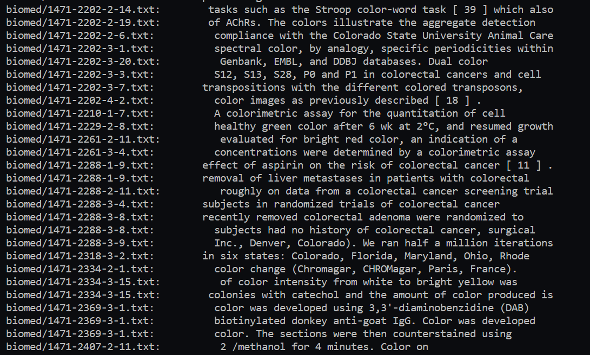
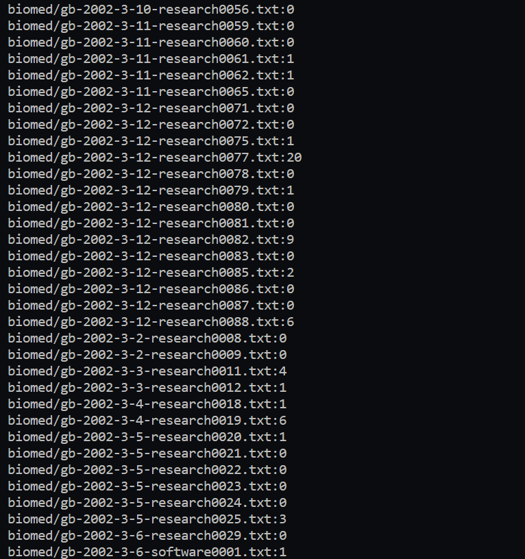

# Lab 3: Bugs and Commands 
## Part One: Bugs 
### Failure inducing input for ```reverseInPlace()```
```
@Test
public void testReverseInPlaceOdd()
{
  int[] input1 = {1,2,3};
  ArrayExamples.reverseInPlace(input1);
  assertArrayEquals(new int[]{3,2,1}, input1};
}
```
### Non-failure inducing input for ```reverseInPlace()```
```
@Test
public void testReverseInPlaceOdd()
{
  int[] input1 = {};
  ArrayExamples.reverseInPlace(input1);
  assertArrayEquals(new int[]{}, input1};
}
```
### Symptoms: 


### Code with bug: 
```
static void reverseInPlace(int[] arr)
  {
      for(int i = 0; i < arr.length; i += 1)
     {
        arr[i] = arr[arr.length - i - 1];
    }
  }
```

### Fixed: 
```
static void reversedInPlace(int[] arr)
{
  for (int i = 0; i < arr.length / 2; i++)
  {
    int temp = arr[i];
    arr[i] = arr[arr.length - i - 1];
    arr[arr.length - i - 1] = temp; 
  }

}
```
### Explanation: In the previous code, the coder failed to account for the value they replaced when assigning the current index to the value of the end of the list. Once replaced, there was no way to get the value that once was at index 'i'. To remedy this, I added a temporary variable to store the value of the current index 'i'. Furthermore, when reversing an array, it can be interpretted as the indices on "opposite" ends switching values, so I also added that step where the index that has its value placed into 'i' also receives the value of 'i' through the temporary value. Lastly, to prevent overwriting values that were already replaced, I split the list in half! 
## Part Two: Researching Commands
## 'grep'

- '-i' (ignore case): This command option ignores the case of the the patter it is searching! For example, working in the technical directory, using ```grep -i 'color' biomed/*.txt``` yields: 



- Here, the command searches for the word or partial word "color" regardless of the case; it is case sensitive! That is why there are words such as Colorado and Color present. 

- ' -c ' (line count) Working in the same directory, using ```grep -c 'color' biomed/*.txt``` yields: 


- Here, instead of printing out all the files that contain the pattern provided the command returns the number of lines that the pattern occurred in each file! 


